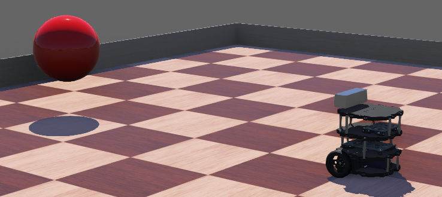
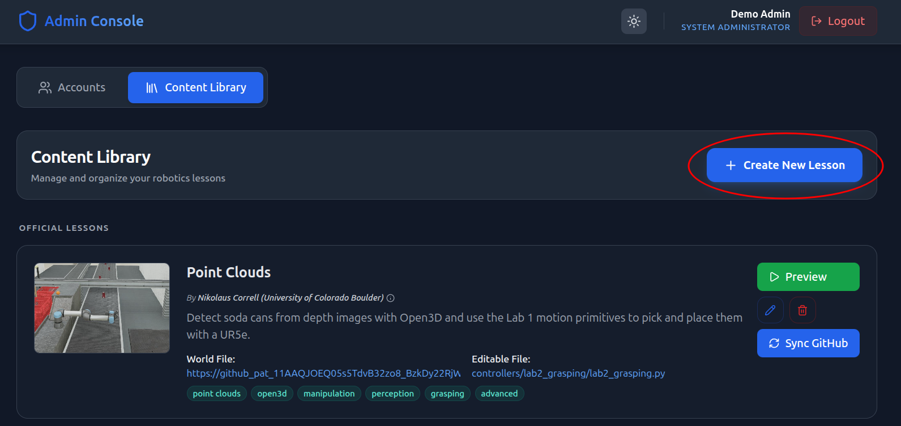
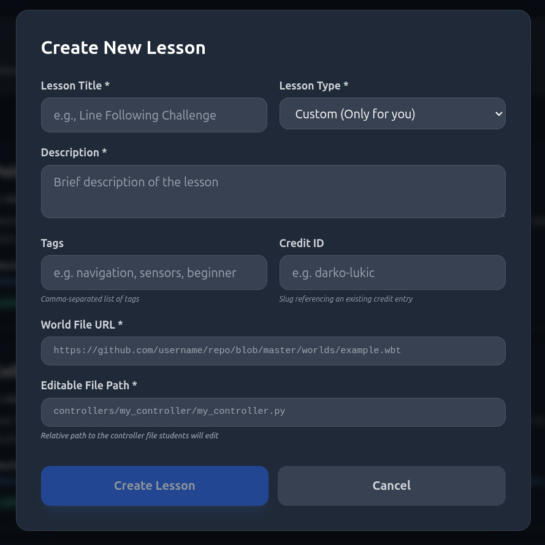

# Webots Academy Example Lesson

This repository is the demo `Visual Tracking` lesson used to show professors how to add a new lesson to Webots Academy.



## Step 1: Create Your Own Simulation

Create a repository that contains:

- a world file under `worlds/`
- one or more controllers under `controllers/`
- a root `README.md` that explains the lesson to students

You are expected to build your own simulation and your own controllers. This repository is only a reference layout.

If your lesson has support controllers such as supervisors, keep them in the repo as normal. Only the controller named by `editable_file_path` becomes the student-editable file in Webots Academy.

## Step 2: Push The Repo To GitHub

Webots Academy sync expects GitHub URLs. After your repo is pushed, identify:

1. the exact GitHub URL to your `.wbt` file
2. the relative path to the controller file students should edit

The URL format should look like:

```text
https://github.com/<owner>/<repo>/blob/<branch>/worlds/<lesson>.wbt
```

The editable path should look like:

```text
controllers/<controller_name>/<controller_file>.py
```

## Step 3: Create The Lesson In Webots Academy

Use the `Content Library` view and the highlighted `Create New Lesson` action:



In the Webots Academy teacher dashboard:

1. Open `Content Library`
2. Click `Create New Lesson`
3. Enter the lesson title and description
4. Paste the GitHub `world_file` URL
5. Enter the `editable_file_path`
6. Save the lesson as a custom lesson

For this repository, use:

```text
world_file=https://github.com/SpesRobotics/webots-academy-example/blob/main/worlds/visual_tracking.wbt
editable_file_path=controllers/visual_tracker/visual_tracker.py
```

The lesson form should look like this when the required fields are filled:



## Step 4: Sync And Preview

After the lesson is created:

1. Click `Sync GitHub`
2. Webots Academy pulls this root `README.md` into the lesson theory panel
3. Webots Academy pulls the file at `editable_file_path` into the editor starter code
4. Click `Preview` to confirm the lesson loads correctly

If you change the repo later, push the update to GitHub and click `Sync GitHub` again.

## Step 5: Assign The Lesson To Students

After the lesson is synced:

1. Create or open a class
2. Add the lesson from the class lesson manager
3. Keep the lesson visible so students can see it
4. Reorder it if needed to match your course progression

Once assigned, the lesson appears in the student dashboard like any other Webots Academy lesson.
